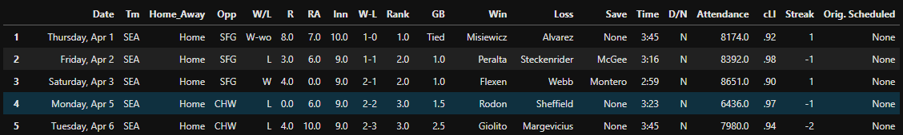
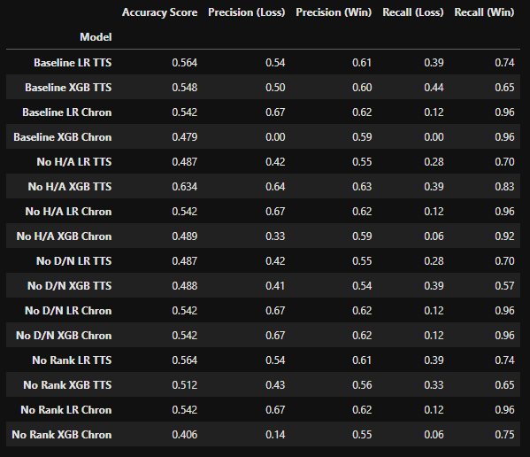
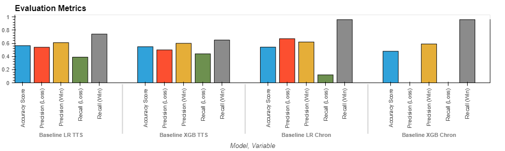

# MLB Predictions
The goal of this project is to create and test a machine learning model that can predict whether or not the Seattle Mariners will lose a game, based on several factors. We created several models with different inputs and tested them to see which model would make the most accurate predictions.

---

## Datasets Used
To obtain our datasets, we used the `schedule_and_record` function from pybaseball, a python library that scrapes statistics from Baseball Reference, Baseball Savant, and FanGraphs. The `schedule_and_record` function pulls game-by-game results data such as the date the game occurred, whether the game was home or away, the name of the opponent, and whether the team won or lost.

```
mariners_2021 = schedule_and_record(2021, 'SEA')
```
The dataframe containing the raw dataset:




Since our goal was to predict the result (win or loss) of the game, we set the 'W/L' column as our target. To create our features dataset, we narrowed down the features by relevance as well as eliminating any features, such as score, that would tell the model the result outright. Our baseline feature dataset consisted of 4 columns: Home/Away, Opponent, Day or Night, and Rank. 

Our dataset contained 162 data points, representing each game in the 2022 Major League Baseball season. We set our training and testing datasets to be 75% and 25% of the total dataset, respectively. When splitting the dataset, we used two different methods, `train_test_split` and list indexing. The `train_test_split` function from Scikit-learn splits the data points randomly, meaning that our training and testing data points would not come from any particular part of the season. We wanted to know how the model would be affected by using the 122 games (75%) of the season for the training dataset and the last 40 games (25%) for the testing dataset, so we used list indexing to split the sets in this way.

## Model Selection
As our question was one of predicting losses and wins of a baseball team using data from prior games, we have set out to research this binary classifcation problem using the logistic regression and XGBoost models to train our datasets and make predictions.

Logistic Regression is one of the most common methods utilizing binary classification, while XGBoost is a model we haven't utilized before.
Logistic Regression is a type of statistical model which is often used for classification and predictive analytics. Logistic Regression estimates the probability of an event occuring based on a given dataset of independent variables.  Since the outcome is a probability, the dependent variable is bounded between 0 and 1. In our model, 0 represents a loss while 1 represents a win.

Extreme Gradient Boosting ("XGBoost") is a scalable, distributed gradient-boosted decision tree machine learning library.  It provides parallel tree boosting and is used for regression, classification, and ranking problems.  The term "gradient boosting" comes from the idea of "boosting" or improving a single weak model by combining it with a number of other weak models in order to generate a collectively strong model.

## Cleaning and Processing PyBaseball Data
The following columns were dropped from the dataset due to irrelevancy:
* Inn (# of innings)
* W-L (Cumulative Record)
* GB (Games behind first place)
* Time (Length of Game)
* Attendance (Number of fans in attendance)
* CLi (Championship Leverage Index)
* Orig Schedule (Original Schedule)

The following columns were dropped due to providing too much predictive value:
* R (Number of runs scored by the Mariners)
* RA (Number of runs scored by the Mariners opponents)
* These two numbers togethor provide the final score of the game.

Due to the nature of the dataset we needed to convert some strings into integers:
* W (Win) was converted to 1, L (Loss) was converted to 0. W-wo (Walk off win) converted to 1, L-wo (Walk off loss) converted to 0
* D (Day) was converted to 0, N (Night) was converted to 0.
* @ (Away) was converted to 1, Home was converted to 0.

OneHotEncoder was used on the dataset to convert text fields into useable numerical data. (Opp/Win/Loss/Save)

## Optimizing Features

After finalizing our features for the baseline performance, we were at four features. It seems that with baseline performance the machine learning models were not able to predict with a high accuracy based on these four features, meaning that there was not enough information within these feature for model to correctly predict outcome of games. Thus, we were only able to try and  optimize by taking out only one feature, while keeping what would seem the most important and in this case we tried three different test, optimizing with the removal of either 'Rank', 'D/N', and 'Home/Away', all while keeping 'Opp'.

## Results
We tested 16 different model variations which produced a variety of results. The following is a dataframe containing the evaluation metrics for all of the models:



As you can see, it is a lot of information to look at, so for a general example we will explain the results of the baseline model, meaning the model that was trained on all of the features. Here we will be comparing the Logistic Regression model with the XGBoost model, as well as the different training and testing datasets.

The following chart is separated into 4 categories: "LR TTS" meaning logistic regression using `train_test_split`, "XGB TTS" meaning logistic regression using `train_test_split`, "LR Chron" meaning logistic regression split chronologically, and "XGB Chron" meaning XGBoost split chronologically.



After testing we found that the models that used `train_test_split` seemed to perform better than the models that were split up chronologically. The latter models seemed to struggle to accurately predict losses, specifically one using XGBoost, while the former seemed to produce more balanced results. For example, our chronologically split XGBoost model scored 0 on precision and recall for predicting losses. Interestingly, our non-baseline models that eliminated a feature scored better in this way. 

Overall, our models were not extremely accurate, but not extremely inaccurate either. 

---

## Installation and Usage
To interact with or edit our project, clone the repository to your machine and open the files using Jupyter Lab.

## Contributors

[Ben Spiegel](https://github.com/brspiegel)

[Lydia Ciummo](https://github.com/lydiaciummo)

[Cuong Ha](https://github.com/chh52)

[Kenny Pham](https://github.com/kvpcrypto)